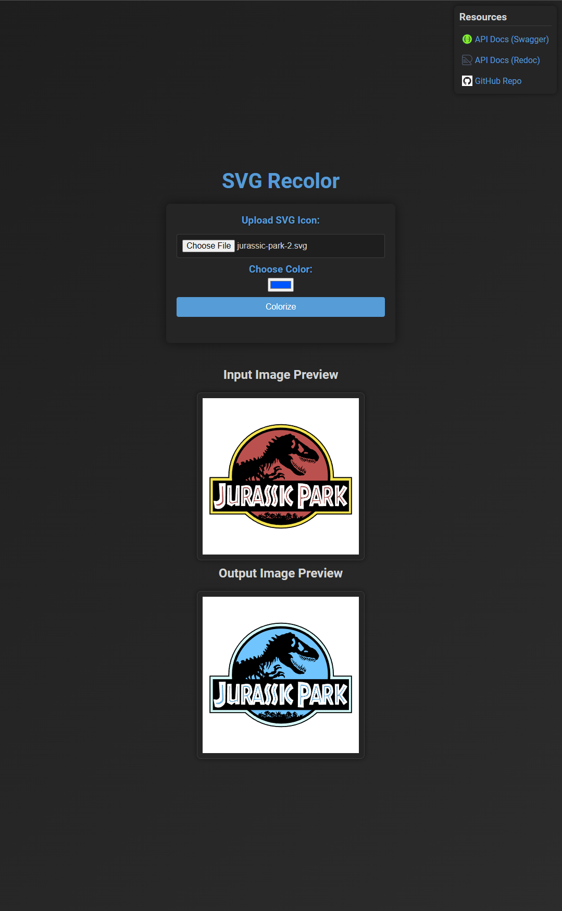

# SVG Recolor

[](https://github.com/Snailedlt/svg-recolor/blob/main/LICENSE)
[](https://wakatime.com/badge/github/Snailedlt/svg-recolor)
[](https://ko-fi.com/snailedlt)
[](https://buymeacoffee.com/snailedlt)

SVG Recolor is a simple CLI tool, API and website to recolor SVG files. It is written in python.

<!--  -->

> [!NOTE]
> Submodules have their own licenses and may or may not be covered by the license of this project. Check the submodule's license for details.

> [!WARNING]
> This project is still under construction and may not be fully functional yet.

## Features

[Website](#website): Use the intuitive web interface to recolor SVG files without any setup.
[API](#api): Integrate SVG recoloring into your applications with ease.
[CLI Tool](#cli-tool): Recolor SVG files directly from your terminal with this Python script.
[Legacy Shell Script](#legacy-shell-script): Same as above, but with a shell script (not maintained).

## Usage

### Website

The website is hosted at [svg-recolor.vercel.app](https://svg-recolor.vercel.app) and requires no installation.

### API

The API is hosted at the same url as the website. You can find the swagger documentation on [svg-recolor.vercel.app/docs](https://svg-recolor.vercel.app/api) or [svg-recolor.vercel.app/redoc](https://svg-recolor.vercel.app/redoc) if you prefer the redoc style.

### CLI Tool

Simply dowload `colorize_svg.py` and run it with python.

Example usage:

```sh
python colorize_svg.py path/to/input.svg path/to/output.svg --color "255,0,0"
```

### Legacy Shell Script

Download `colorize_svg.sh` and run it in your terminal.

Example Usage:

```bash
# Recolor the input SVG file to red and save it to the output file using RGB color values
./colorize_svg.sh "example-input-svgs/input.svg" tmp/output.svg --color "255,0,0"

# Recolor the input SVG file to red and save it to the output file using hex color values
./colorize_svg.sh "example-input-svgs/input.svg" tmp/output.svg --color "#FF0000"
```

## Contributing

See any bugs or missing features? Feel free to open an issue or submit a pull request, I'm open to anything!
Check out [Local Development](#local-development) for more information on how to set up the project locally.

Other ways to contribute:

[](https://ko-fi.com/H2H0GY0OU)
<!--markdownlint-disable-next-line MD033 -->
<a href="https://www.buymeacoffee.com/snailedlt" target="_blank"></a>

## Local Development

### Requirements

- Python 3.10 or higher
- [Pipenv](https://pipenv.pypa.io/en/latest/)

### Installation

Clone the repository and install the dependencies using pipenv.

```sh
git clone https://github.com/Snailedlt/svg-recolor.git
cd svg-recolor
pipenv install
```

Compile svgshift (a submodule) by running the following command
Replace `<your-environment>` with your environment (e.g. windows, linux).

```sh
gcc submodules/svgshift/svgshift.c -o svgshift-<your-environment>.exe
```

### Running the API

To run the API, use the following command:

```sh
pipenv run dev
```

### Running the CLI Tool

If you wish to run the CLI without downloading the required dependencies to a separate virtual env, you can use the following command:

```sh
# Update the dependencies if you haven't already
pipenv update
pipenv run colorize path/to/input.svg path/to/output.svg --color "255,0,0"
```
